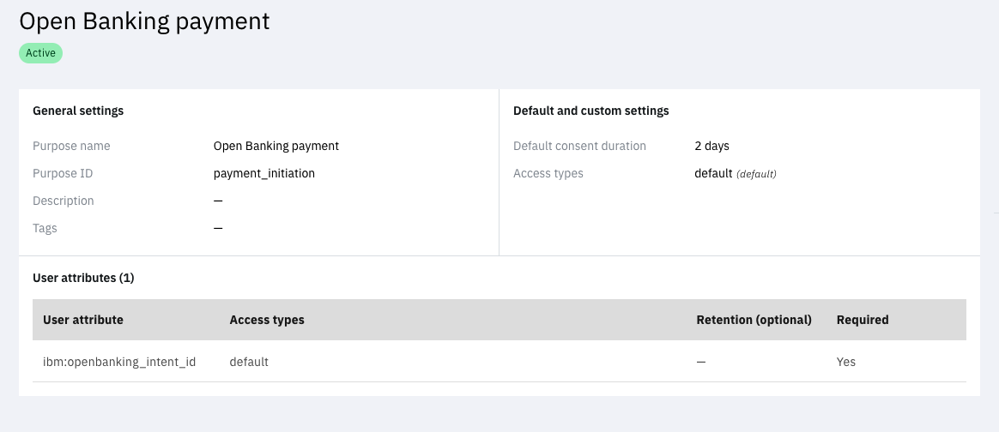

# FAPI Demo

Use this application to configure a FAPI-compliant flow. The application is built with Node.js and uses [openid-client](https://www.npmjs.com/package/openid-client). All UI assets can be found under [views](/views) and [public](/public). All views are written using vanilla HTML and JS and templated using Handlebars.

The demo uses a resource API hosted behind AWS API Gateway. The lambdas and contract details will be added in a future iteration of this document.

In this app, you can do the following -

1. Authenticate the client using either `private_key_jwt` or `tls_client_auth`
2. Viewing the authenticated user's profile by unpacking the id_token
3. Viewing the introspection payload

You can run this in multiple modes, where you vary the client authentication options and choose to enable certificate bound access tokens.

## Pre-requisites

1. Install Node and Git on your machine
2. Clone this repo to your machine
3. [IBM Security Verify tenant](https://docs.verify.ibm.com/verify/docs/signing-up-for-a-free-trial)

## Setup

This guide will provide a prescriptive configuration but you can vary this:

1. `private_key_jwt` used
2. Certificate bound access tokens disabled

> **NOTE:** You need a custom domain on your Verify tenant that is configured with the CA bundle provided by your PKI that would issue the client certificate. Given this isn't available for trial tenants, the instructions here disable this option. However, if you do have a custom domain available and configured, enable this option.

### Set up the transaction type

1. Login to the Verify admin console

2. Go to "Data privacy & consent" > "Data purposes"

3. Click "Create purpose"

4. Follow the wizard and enter the following:
    - Purpose name: Open Banking payment
    - Purpose ID: payment_initiation
    - Add access type `default`. This is an out of the box access type.
    - Add user attribute `ibm:openbanking_intent_id` and choose the access type as `default`
    - Set the consent expiration to any value of your choice

Once created, the summary view would look as below.



### Configure IBM Security Verify

1. Login to the Verify admin console

2. Go to Applications > Applications in the navigation panel and click on "Add Application"

3. Search for "OpenID Connect for Open Banking" and choose the connector. Click "Add Application"

4. Enter the general information and switch to the "Sign On" tab

5. Choose the following:
    - `Authorization code` grant type allowed
    - `private_key_jwt` client authentication method
    - Enforce pushed authorization request
    - Enable "certificate bound access token" if you have a certificate. If you don't, do not enable this
    - Choose "PS256" as the signature algorithm

6. Under Endpoint Configuration, click on the edit icon next to "Authorize". Choose "Edit" next to "Open Banking Intent ID" and copy/paste the following code snippet.

    ```yaml
    statements:
    - if:
        match: "!has(requestContext.claims_idtoken_openbanking_intent_id)"
        return: null
    - context: "intentID := requestContext.getValue('claims_idtoken_openbanking_intent_id')"
    - context: 'intentContext := hc.getAsJSON("https://9f1uo420uf.execute-api.us-east-1.amazonaws.com/internal/intents/" + context.intentID, { "Authorization": "apikey supersecretapikey" })'
    - return: >-
        {
            "type": context.intentContext.type,
            "intentID": context.intentID,
            "currency": context.intentContext.instructedAmount.currency,
            "amount": context.intentContext.instructedAmount.amount,
            "trx_name": context.intentContext.creditorName,
            "claims": {
                "openbanking_intent_id": context.intentID,
                "trx_name_claim": "Transaction name"
            }
        }
    ```

7. Choose the identity sources and access policy, as desired.

8. Select "Ask for consent" for User Consent

9. Save and set "Automatic access for all users and groups" under the Entitlements tab

10. Switch to the Privacy tab and add `Open Banking payment` from the list of purposes allowed for the application.

11. Switch to API access tab and add a new API client (you may name it anything you like). Either uncheck "Restrict custom scopes" or add `payment` to the allowed scopes. These client credentials are designated `API_CLIENT_ID` and `API_CLIENT_SECRET`.

12. Generate a jwks containing the private key and obtain a public cert. Upload the public cert into "Security" > "Certificates" under "Signer certificates"
    - You can use a tool like [mkjwk](https://mkjwk.org/) for the purposes to testing this app. Use `PS256` as the algorithm. Copy the public and private keypair into the app's config directory - `config/jwks.json`. Download the self-signed certificate as a PEM file and upload it to Verify as described.

### Setup the application

1. Copy `dotenv` file to `.env` and populate the values as below
    - `TENANT_URL`: Set your Verify tenant URL hostname here. If you are using a custom domain, use that hostname. An example of this value is `harbinger.verify.ibm.com`.
    - `DISCOVERY_URL`: Set the Open ID Connect discovery (well-known) endpoint here. This would follow the pattern `https://yourtenant/oauth2/.well-known/openid-configuration`.
    - `CLIENT_ID`: The OIDC client ID generated in the Sign On tab of the application
    - `CLIENT_SECRET`: The OIDC client secret generated in the Sign On tab of the application
    - `SCOPE`: If you aren't sure what to set here, just set this as `openid profile`
    - `MTLS_OR_JWT`: Set this to `jwt`
    - `CERT_BOUND`: Set this to true if you have a custom domain configured to perform mTLS and have an issued client certificate that you can use with this application
    - `API_CLIENT_ID`: The OAuth client ID generated for the API client under the application's API Access tab
    - `API_CLIENT_SECRET`: The OAuth client secret generated for the API client under the application's API Access tab
    - `RESOURCE_BASE_URL`: Leave this unchanged

2. If you have a client certificate issued by the PKI whose bundle has been added to IBM Security Verify, add the public key under `config/cert.pem` and the private key under `config/key.pem`.

## Run the application

1. Install node dependencies

    ```bash
    npm install
    ```

2. Run the application. You should see `Server started and listening on port 3000` after executing the command below.

    ```bash
    npm start
    ```

3. Open the browser and go to http://localhost:3000 and you should be able to use the application. Click Login and away you go.